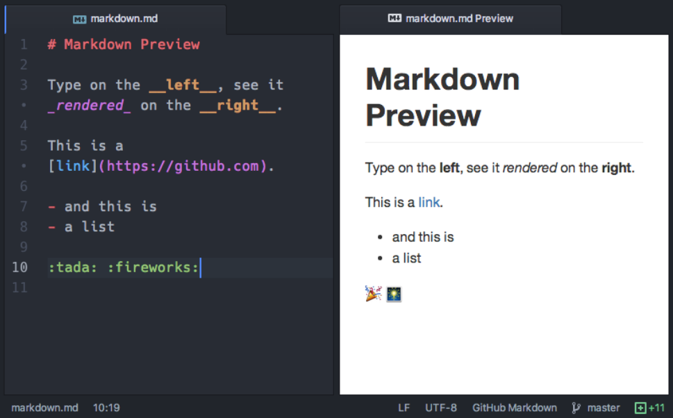

# MARKDOWN

## ¿Qué es Markdown y para que se usa?

**Markdown es un lenguaje de conversión de texto plano a HTML, tiene la finalidad de crear contenido de forma simple  y manteniendo un diseño legible.**

**Nos permite múltiples usos siempre con la finalidad de usar un estándar y siempre se visualice con el mismo diseño (formato):**

- Documentar tu Repositorio de Código.
- Abrir Issues en Github.
- Escribir en Trello o foros como Stackoverflow
- Y muchos más también soportan este lenguaje, incluso podrías escribir un libro.

## Sintáxis Markdown

A continuación visualizamos los conceptos básicos para escribir nuestra documentación utilizando este lenguaje de marcado. Será muy fácil de aprender de hecho una vez terminemos el curso estaréis totalmente capacitados para escribir en este lenguaje, estas son algunas de las cosas que podremos realizar.
Enlace de ayuda y consulta:
- https://markdown-it.github.io/
- https://github.com/markdown-here/wiki/Markdown-Cheatsheet

--------
- Elementos de bloque
    - Párrafos y saltos de línea
    - Encabezados
    - Citas
    - Listas
    - Códigos de bloque
    - Reglas horizontales
- Elementos de línea
    - Énfasis
    - Links o enlaces
    - Imágenes
    - Videos de Youtube
    - y mucho más..

## Es hora de jugar un poco!!

- Crear repositorio limpio y crear un fichero README.md.
- Editar README.md con nuestro editor de texto preferido, con plugin de Markdown para tener un preview en directo antes de subir cambios al repositorio.
- Creamos el siguiente contenido en nuestro Markdown.
- Guardamos y subimos los cambios a nuestro repo.

